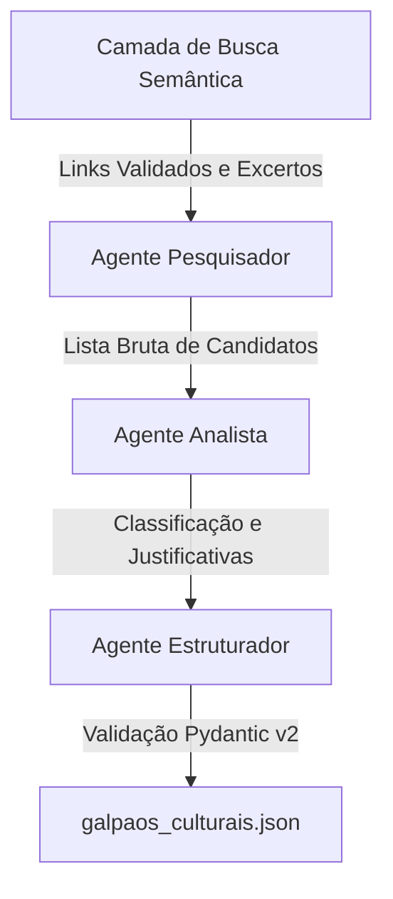

# PONTIFÍCIA UNIVERSIDADE CATÓLICA DE SÃO PAULO
**Faculdade de Ciências Sociais**  
**Programa Institucional de Bolsas de Iniciação Científica — PIBIC 2025/2026**  

<br>
<br>

## RELATÓRIO FINAL DE INICIAÇÃO CIENTÍFICA

<br>

**SISTEMA MULTIAGENTE PARA IDENTIFICAÇÃO DE GALPÕES INDUSTRIAIS REUTILIZADOS COMO ESPAÇOS CULTURAIS NO ESTADO DE SÃO PAULO**

<br>
<br>

| | |
|---|---|
| **Bolsista:** | Thiago Villela |
| **Curso:** | Ciências Sociais |
| **Orientador:** | Profª Drª Monica Carvalho |
| **Título do projeto:** | Sistema Multiagente para Identificação de Galpões Industriais Reutilizados como Espaços Culturais no Estado de São Paulo |
| **Período de vigência da bolsa:** | Setembro de 2025 – Agosto de 2026 |

<br>
<br>
<br>

São Paulo  
2026

---

## RESUMO

Este relatório final apresenta a consolidação e os resultados de uma pesquisa interdisciplinar que articula a sociologia urbana, a antropologia do espaço e as metodologias computacionais aplicadas às Ciências Sociais. O objetivo central é mapear, catalogar e analisar a reutilização cultural de imóveis industriais desativados (fábricas, galpões, armazéns e depósitos) no estado de São Paulo. Metodologicamente, desenvolveu-se um sistema automatizado de inteligência artificial generativa com arquitetura multiagente (utilizando o framework CrewAI), integrado a uma camada determinística de busca semântica, filtragem de ruídos comerciais e validação de acessibilidade HTTP. Esse sistema permitiu identificar e estruturar dados sobre 19 iniciativas de reconversão cultural distribuídas em diversas regiões do estado. Do ponto de vista teórico, o trabalho analisa a transição de uso desses espaços sob a ótica da produção do espaço urbano (Henri Lefebvre, David Harvey), das "rugosidades" territoriais (Milton Santos), da preservação e patrimônio industrial (Françoise Choay, TICCIH) e das tensões inerentes à gentrificação e ao consumo estético da ruína (Sharon Zukin). Os resultados demonstram a potencialidade metodológica das arquiteturas agênticas para a superação de silêncios cadastrais em fenômenos urbanos difusos, enquanto a análise empírica dos casos revela as disputas entre o valor de uso comunitário da memória operária e as pressões de valorização imobiliária e regularização burocrática que ameaçam esses territórios de resistência cultural.

**Palavras-chave:** Patrimônio Industrial. Espaços Culturais. Sistemas Multiagente. CrewAI. Sociologia Urbana. São Paulo.

---

## SUMÁRIO

1. [INTRODUÇÃO](#1-introdução)
   * 1.1 [Contextualização do Tema](#11-contextualização-do-tema)
   * 1.2 [Problema de Pesquisa](#12-problema-de-pesquisa)
   * 1.3 [Hipóteses e Questões Centrais](#13-hipóteses-e-questões-centrais)
   * 1.4 [Objetivos](#14-objetivos)
   * 1.5 [Justificativa](#15-justificativa)
2. [REFERENCIAL TEÓRICO](#2-referencial-teórico)
3. [METODOLOGIA](#3-metodologia)
4. [ESTUDOS DE CASO](#4-estudos-de-caso)
5. [ANÁLISE E DISCUSSÃO](#5-análise-e-discussão)
6. [CONSIDERAÇÕES FINAIS](#6-considerações-finais)
7. [REFERÊNCIAS BIBLIOGRÁFICAS](#7-referências-bibliográficas)

---

## 1. INTRODUÇÃO

### 1.1 Contextualização do Tema

O processo de estruturação territorial do estado de São Paulo ao longo do século XX é indissociável da expansão da atividade industrial. O desenvolvimento fabril desenhou redes de circulação, promoveu dinâmicas migratórias intensas e consolidou morfologias urbanas específicas, caracterizadas pela proximidade entre complexos produtivos, ferrovias e vilas operárias. Cidades como a capital paulista — nos bairros tradicionais da Mooca, Brás, Lapa, Belenzinho e Barra Funda —, os municípios do Grande ABC (Santo André, São Bernardo do Campo, São Caetano do Sul) e polos regionais do interior (como Campinas, Sorocaba, Itu, Rio Claro e Bauru) estruturaram suas paisagens urbanas sob a égide das chaminés, dos trilhos ferroviários e das grandes coberturas em shed de seus complexos industriais.

No entanto, a partir do último quartel do século XX e de forma acelerada na década de 1990, a reestruturação produtiva global, a abertura econômica comercial e a desconcentração industrial reconfiguraram essa geografia. Grandes fábricas e ramais ferroviários foram gradualmente desativados, deslocando as atividades produtivas dinâmicas para outras regiões do país ou para o entorno de rodovias distantes dos centros consolidados. Esse processo de desindustrialização deixou como rastro no tecido urbano paulista um vasto estoque de ruínas industriais: galpões vazios, armazéns abandonados, usinas inativas e pátios ferroviários ociosos.

Longe de serem espaços neutros, estas estruturas constituem o que o geógrafo Milton Santos denominou como "rugosidades" territoriais — formas espaciais do passado que permanecem no presente, atuando como testemunhas de um tempo social pretérito e impondo limites e possibilidades à reorganização contemporânea da cidade. Em termos materiais, sua permanência confronta o planejamento urbano com problemas de degradação e esvaziamento econômico. Em termos simbólicos e sociais, no entanto, essas antigas fábricas guardam a memória coletiva do trabalho operário, de lutas sindicais e da identidade comunitária local.

Nas últimas décadas, a reutilização adaptativa dessas "rugosidades" industriais desativadas para fins de fruição cultural tem emergido como uma das principais tendências de transformação urbana no estado. Trata-se do fenômeno em que antigas instalações têxteis, de cimento, alimentícias ou ferroviárias são reconvertidas em centros culturais, escolas de artes, ateliês coletivos, galerias de arte contemporânea ou palcos de teatro comunitário. Essas iniciativas variam drasticamente em sua natureza: vão desde projetos institucionais planejados e financiados pelo poder público ou pelo Terceiro Setor (como as Fábricas de Cultura estaduais e unidades do SESC) até ocupações artísticas e culturais autônomas que emergem da mobilização comunitária local em bairros periféricos e no interior do estado.

### 1.2 Problema de Pesquisa

A despeito da relevância histórica, sociológica e urbanística dessas iniciativas de reutilização cultural, constata-se a inexistência de um cadastro unificado, sistemático e de livre acesso que mapeie esses espaços no âmbito do estado de São Paulo. Os dados sobre essas experiências encontram-se profundamente dispersos em reportagens de jornais locais, portais de divulgação artística, publicações institucionais de prefeituras, teses acadêmicas e, frequentemente, em redes sociais administradas de forma precária por coletivos artísticos periféricos e independentes.

Essa fragmentação das fontes digitais gera um problema de "invisibilidade cadastral", ocultando a real dimensão geográfica e social da reutilização do patrimônio industrial em São Paulo. O levantamento manual desse universo por parte de pesquisadores sociais e planejadores urbanos constitui um esforço hercúleo, caro e de difícil atualização periódica, limitando a formulação de análises transversais e de políticas públicas de preservação e fomento cultural.

Além da problemática empírica, a pesquisa defronta-se com um desafio metodológico: como capturar, processar e catalogar de forma automatizada e semanticamente consistente dados qualitativos difusos presentes na web aberta? Os métodos tradicionais de busca por palavras-chave em motores de busca comerciais ou de raspagem de dados estática (web scraping simples) são incapazes de realizar a triagem semântica necessária para separar casos genuínos de reconversão funcional de ruídos recorrentes, tais como anúncios de aluguel e venda de galpões, lançamentos imobiliários com apelo estético "industrial" ou reformas superficiais de fachadas que não envolvem mudança de uso do solo.

### 1.3 Hipóteses e Questões Centrais

O desenvolvimento deste estudo apoia-se nas seguintes hipóteses teóricas e empíricas:

* **Hipótese Metodológica:** Sistemas multiagente baseados em Large Language Models (LLMs), orientados por instruções cognitivas rigorosas e integrados a uma camada determinística de busca semântica e validação de URLs, são capazes de simular o trabalho de clipping e curadoria de dados qualitativos em escala superior às ferramentas de raspagem tradicionais, mitigando de forma controlada o risco de alucinação de dados factuais.
* **Hipótese Sócio-Espacial:** A reutilização cultural de galpões industriais no estado de São Paulo atua como um vetor de transição de uso e ressignificação simbólica que transforma espaços originalmente marcados pela disciplina fordista e pela exploração operária em territórios voltados ao ócio estético e à emancipação comunitária. Entretanto, essa reconversão não ocorre sem conflitos, sendo frequentemente tensionada por pressões de valorização imobiliária (gentrificação) nos centros metropolitanos e por processos de precarização institucional e repressão burocrática nos territórios periféricos e no interior.

Deste modo, a pesquisa busca responder às seguintes questões centrais:
1. Em que medida as arquiteturas multiagente inteligentes podem ser aplicadas com rigor metodológico para coletar e consolidar dados qualitativos sobre rugosidades urbanas paulistas?
2. Quais são as tipologias de reuso e de patrimônio industrial mais recorrentes no estado de São Paulo a partir das iniciativas identificadas?
3. De que maneira a teoria sociológica urbana explica as tensões entre o valor de uso (memória e fruição cultural) e o valor de troca (especulação imobiliária) que atravessam esses galpões reutilizados?

### 1.4 Objetivos

#### Objetivo Geral:
Mapear, catalogar e analisar sociologicamente os galpões industriais desativados que foram reutilizados como espaços culturais no estado de São Paulo, utilizando como instrumento metodológico central um sistema multiagente inteligente e validado.

#### Objetivos Específicos:
1. **Implementar e refinar a arquitetura multiagente** baseada no framework CrewAI e em modelos de linguagem avançados (GPT-4o), aprimorando os critérios cognitivos dos agentes Pesquisador, Analista e Estruturador.
2. **Desenvolver e validar uma camada de busca semântica** determinística em Python para triagem, remoção de spam imobiliário e verificação técnica de acessibilidade das URLs das fontes consultadas.
3. **Consolidar um banco de dados padronizado** em formato JSON com todos os espaços identificados no estado, garantindo rigor factual em relação aos endereços, antigos usos, anos de reutilização e fontes de informação.
4. **Analisar qualitativa e comparativamente os 19 espaços culturais identificados**, classificando suas tipologias de reuso, a natureza do seu patrimônio industrial original e as dinâmicas sociais locais.
5. **Problematizar as tensões sócio-espaciais** decorrentes dessas reconversões sob o referencial teórico da produção social do espaço e da gentrificação.

### 1.5 Justificativa

A justificativa deste trabalho assenta-se na sua natureza profundamente interdisciplinar, oferecendo contribuições em dois campos complementares:

No **campo metodológico das Ciências Sociais**, a pesquisa responde à necessidade contemporânea de apropriação crítica e técnica das novas ferramentas de inteligência artificial generativa. Em vez de adotar uma postura de rejeição ou recepção passiva dos LLMs, o trabalho demonstra como essas tecnologias podem ser programadas, testadas e orquestradas em arquiteturas multiagente com o rigor e a intencionalidade próprios da pesquisa científica social. O estudo propõe uma metodologia inovadora para superar silêncios censitários e cadastrais a partir da curadoria automatizada de vestígios digitais na web aberta.

No **campo sociológico e urbanístico**, a relevância reside em visibilizar e analisar o reuso adaptativo do patrimônio industrial em um estado historicamente central para a formação operária brasileira. Ao documentar e analisar iniciativas espalhadas da capital ao interior, a pesquisa contribui para a reflexão crítica sobre a destinação das "rugosidades" urbanas obsoletas, sustentando que a salvaguarda da memória do trabalho não deve residir apenas na monumentalização estática do museu, mas sim na ocupação viva e democrática de seus espaços pela cultura e pelas comunidades locais.

---

## 2. REFERENCIAL TEÓRICO

A análise da reutilização de galpões industriais desativados como espaços culturais requer a articulação de um arcabouço conceitual interdisciplinar. Este referencial teórico organiza-se a partir de cinco eixos fundamentais: a conceituação do patrimônio industrial, a noção de rugosidades territoriais, as teorias sobre a produção social do espaço, a economia simbólica da gentrificação e a preservação da memória coletiva ancorada no território.

### 2.1 O Patrimônio Industrial e as Políticas de Reuso Adaptativo

A compreensão do que constitui o patrimônio histórico passou por profundas transformações conceituais ao longo do século XX. Como assinala a historiadora francesa Françoise Choay em sua clássica obra *A Alegoria do Patrimônio* (2001), o conceito original de "monumento" — a forma erguida intencionalmente para evocar a memória de um acontecimento ou figura de poder — gradualmente cedeu lugar ao de "monumento histórico". Este último não é fruto de um projeto prévio de celebração, mas de um olhar retrospectivo que atribui valor cognitivo, estético e histórico a formas herdadas do passado.

Historicamente, as políticas de conservação privilegiaram edifícios vinculados às elites políticas e religiosas, como palácios, catedrais e teatros clássicos. Apenas na segunda metade do século XX consolidou-se o campo da arqueologia industrial, deslocando a atenção patrimonial para as formas construídas associadas à produção material e ao cotidiano das classes trabalhadoras. As instalações fabris, minas, ramais ferroviários e infraestruturas portuárias passaram a ser lidas não como detritos obsoletos do processo produtivo, mas como documentos físicos de valor insubstituível para a história da tecnologia, do trabalho e da arquitetura.

No plano internacional, esse consenso cristalizou-se na *Carta de Nizhny Tagil sobre o Patrimônio Industrial* (2003), formulada pelo TICCIH (*The International Committee for the Conservation of the Industrial Heritage*). O documento define que o patrimônio industrial compreende os restos da cultura industrial que possuem valor histórico, tecnológico, social, arquitetônico ou científico. A Carta destaca que a melhor forma de salvaguarda destas estruturas reside no **reuso adaptativo** (*adaptive reuse*) — a intervenção arquitetônica que introduz novas funções (como a atividade cultural e educacional) sem desfigurar os elementos estruturais e históricos que testemunham o antigo uso industrial. O reuso funcional apresenta-se como alternativa à monumentalização estática, permitindo reintegrar a estrutura obsoleta à dinâmica urbana ativa.

### 2.2 As "Rugosidades" como Elemento de Transição Territorial

Para situar geograficamente e historicamente o fenômeno no estado de São Paulo, mobiliza-se o conceito de **rugosidades**, cunhado pelo geógrafo brasileiro Milton Santos em *A Natureza do Espaço* (1996). Para Santos, o espaço geográfico é formado por um sistema indissociável de objetos e ações. As formas geográficas criadas em momentos anteriores para atender a exigências técnicas, econômicas e sociais específicas persistem no tempo material mesmo após o desaparecimento das funções originais que as engendraram.

As rugosidades representam, portanto:
> "[...] o tempo passado cristalizado, sob a forma de formas-conteúdo, de paisagens que se interpõem no presente e limitam a ação dos novos modos de produção ou do novo ordenamento territorial." (SANTOS, 1996, p. 112)

Os grandes galpões industriais desativados que pontilham as cidades paulistas são rugosidades da era de acumulação fordista. Quando o capital des territorializa a produção em direção a áreas com custos tributários e de mão de obra inferiores, a casca física da fábrica permanece na malha urbana. Essa permanência material gera um descompasso temporal: a forma (o galpão industrial) sobrevive ao conteúdo (a atividade industrial fabril). 

Como rugosidades, essas edificações são ao mesmo tempo obstáculos e recursos. Atuam como obstáculos à fluidez total do capital financeiro contemporâneo, que comumente prefere terrenos limpos para novos empreendimentos imobiliários homogeneizadores. Por outro lado, configuram-se como recursos para a cidade ao oferecerem estruturas construtivas amplas e dotadas de pé-direito elevado, flexibilidade de layout e centralidade urbana, constituindo suportes materiais ideais para acolher os novos fluxos da economia dos serviços e da produção cultural.

### 2.3 A Produção Social do Espaço Urbano e a Economia Simbólica

A transição funcional e simbólica do espaço fabril para o cultural insere-se nas disputas mais amplas da produção do espaço nas metrópoles capitalistas. Sob a ótica do sociólogo Henri Lefebvre em *A Produção do Espaço* (1991), o espaço não é um receptáculo vazio ou um mero cenário da vida social; ele é um produto social. Lefebvre estrutura a produção espacial a partir de uma tríade dialética:
1. **O espaço concebido (representações do espaço):** o espaço dos planejadores urbanos, tecnocratas e do capital imobiliário, codificado em planos diretores, zoneamentos e discursos de revitalização;
2. **O espaço percebido (práticas espaciais):** a materialidade do cotidiano urbano, caracterizada pelas redes de transporte, circulação física e trabalho;
3. **O espaço vivido (espaços de representação):** o espaço dos usuários e habitantes, marcado por vivências subjetivas, simbolismos e apropriações informais.

Quando os galpões industriais são desativados, o espaço concebido pelo planejamento de mercado tende a classificá-los como "vazios urbanos" ou "áreas degradadas" que requerem intervenção higienista para restaurar a lucratividade da terra. Em contrapartida, os movimentos culturais e comunitários apropriam-se dessas ruínas, transformando-as em espaços vividos de resistência política e manifestação artística. Há aqui um conflito de apropriação: a disputa entre o desenho abstrato do planejador e o uso vivo da comunidade.

Essa tensão é aprofundada pela análise de David Harvey em *A Urbanização do Capital* (1985). Harvey demonstra que o ambiente construído urbano constitui o "segundo circuito do capital", para onde os excedentes de riqueza são deslocados quando o circuito produtivo primário entra em crise de superacumulação. A reconversão urbana de galpões industriais, nesse sentido, pode servir aos interesses de acumulação ao converter o valor de uso histórico e a memória operária das fábricas em capital simbólico. A cultura é instrumentalizada para gerar diferencial competitivo e "marca espacial", permitindo a extração de rendas de monopólio sobre o espaço revitalizado.

### 2.4 Gentrificação, *Loft Living* e a Estética da Ruína

O papel da cultura na transição urbana de áreas desindustrializadas é um dos focos analíticos centrais da socióloga norte-americana Sharon Zukin. Em seu clássico estudo *Loft Living* (1982), Zukin analisa a transformação do bairro do SoHo, em Nova York, demonstrando como antigas instalações industriais do século XIX, antes ocupadas por indústrias manufatureiras leves, foram inicialmente ocupadas por artistas que necessitavam de espaços amplos e baratos para moradia e produção de arte contemporânea.

No entanto, o processo que Zukin denomina como *"pacificação pelo consumo"* demonstra que a presença inicial de artistas e iniciativas culturais valorizou simbolicamente a região, atraindo a atenção de promotores imobiliários e da classe média alta. Gradualmente, a apropriação comunitária original foi substituída por um processo de **gentrificação comercial e residencial**, em que a estética industrial originária (tijolos aparentes, vigas metálicas expostas, grandes janelas) foi esvaziada de seu caráter popular e operário para converter-se em mercadoria estéril de luxo: o estilo *loft*.

Em *The Cultures of Cities* (1995), Zukin teoriza a cultura como o motor econômico contemporâneo das cidades, estruturado em uma economia de símbolos e controle. O patrimônio industrial reformado corre o risco constante de sofrer uma higienização estética que oculta as antigas relações de trabalho e exploração laboral que constituíram o espaço, substituindo-as por espaços assépticos de consumo cultural e serviços voltados à classe média. Há, assim, uma tensão dialética entre:
- A apropriação democrática do galpão para a cultura comunitária periférica e do interior;
- O uso mercadológico do patrimônio como engrenagem de atratividade imobiliária e valorização do solo urbano.

### 2.5 Memória Coletiva e Territorialidade Operária

Para além da dimensão econômica, a reutilização de espaços industriais toca diretamente a preservação da identidade dos trabalhadores. Como sustenta Maurice Halbwachs em *A Memória Coletiva* (1990), a memória humana não reside em uma gaveta puramente psicológica ou individual: ela necessita de suportes materiais e espaciais para se constituir e persistir. O grupo social projeta sua identidade no espaço físico que habita, e cada detalhe da paisagem urbana serve como ponto de referência para a lembrança coletiva:
> "Não há memória coletiva que não se desenrole dentro de um quadro espacial." (HALBWACHS, 1990, p. 133)

A demolição sistemática de antigas indústrias e a subsequente substituição de bairros fabris por condomínios residenciais ou shoppings assépticos provocam um fenômeno de "amnésia urbana", desterritorializando a memória coletiva da classe trabalhadora. Nesse sentido, os galpões industriais reconvertidos funcionam como âncoras físicas da memória operária. A preservação destas estruturas arquitetônicas — mesmo que sob novos usos artísticos — salvaguarda a presença física de espaços que abrigaram conflitos trabalhistas históricos e vidas cotidianas de famílias imigrantes e migrantes.

O reuso cultural democrático atua, portanto, como um ato de resistência patrimonial e de afirmação da territorialidade. Ao reocuparem o barracão ferroviário ou o galpão têxtil, os grupos culturais e as comunidades periféricas reconstituem o valor de uso do espaço. O território deixa de ser o local de opressão do relógio de ponto e do capataz fordista e se converte em local de criação, formação coletiva e de partilha da história de vida das gerações passadas, garantindo que o direito à cidade se materialize na disputa ativa pelo patrimônio histórico urbano paulista.

---

## 3. METODOLOGIA

A metodologia deste trabalho é de caráter qualitativo, exploratório e interdisciplinar, apoiando-se no desenvolvimento e validação de um sistema computacional customizado para a captura de dados na web aberta. A arquitetura do sistema foi projetada para lidar com a dispersão e a informalidade das fontes digitais sobre o patrimônio paulista, estruturando-se em duas camadas complementares: uma camada de inteligência artificial generativa baseada em um sistema multiagente (CrewAI) e uma camada de busca semântica e filtragem determinística implementada em Python.

### 3.1 Arquitetura Multiagente do Sistema (CrewAI)

O núcleo cognitivo do sistema baseia-se em uma arquitetura de múltiplos agentes autônomos orquestrados através do framework CrewAI (CREWAI, 2025). O sistema divide a complexa tarefa de identificação, classificação e extração de dados em subtarefas coordenadas executadas por três agentes altamente especializados:

* **Pesquisador de Patrimônio Cultural Reutilizado:** Configurado com o papel de jornalista investigativo especializado em cultura urbana. Seu objetivo é explorar a web (e o cache de resultados fornecido pela camada semântica) em busca de evidências de imóveis desativados reconvertidos para cultura. Possui o parâmetro `max_iter=60` configurado para garantir a profundidade da busca e tolerância a caminhos de exploração longos.
* **Analista de Relevância Cultural e Patrimônio Industrial:** Configurado com o perfil de arquiteto com doutorado em patrimônio histórico. Sua função é avaliar criticamente as descrições trazidas pelo Pesquisador, confrontando-as com critérios rígidos de relevância patrimonial. Este agente não possui ferramentas de busca, operando exclusivamente via raciocínio analítico sobre o contexto compartilhado.
* **Estruturador de Dados de Espaços Culturais:** Atua como um engenheiro de dados. Sua tarefa exclusiva é extrair as informações validadas pelo Analista e organizá-las no formato estruturado definitivo, aplicando diretrizes de preenchimento rígidas (como o uso obrigatório de `"não informado"` para campos vazios e a proibição absoluta de suposições).

A orquestração dos agentes adota um processo estritamente sequencial (`Process.sequential`). O fluxo de dados é encadeado por meio de dependências de contexto declaradas em arquivos de configuração YAML (`config/tasks.yaml`), de modo que o output em linguagem natural de cada agente serve de subsídio de entrada para a tarefa do agente seguinte, reduzindo drasticamente a dispersão temática.



### 3.2 Modelos de Dados e Validação Estrutural (Pydantic v2)

Para garantir a integridade dos dados gerados antes de sua gravação física, o sistema utiliza a biblioteca Pydantic v2 para a validação de schemas de dados. O arquivo `models.py` define a estrutura da informação em duas classes principais:

1. **`EspacoCultural` (Schema de Item):** Representa um espaço mapeado, contendo os campos: `nome` (str), `endereco` (str, default `"não informado"`), `municipio` (str), `antigo_uso` (str), `uso_atual_cultural` (str), `ano_reutilizacao` (str, default `"não informado"`), `fonte` (str), `relevancia` (Literal["relevante", "parcialmente relevante", "não relevante"]) e `justificativa` (str).
2. **`RelatorioGalpoesCulturais` (Schema Raiz):** Representa o arquivo JSON consolidado final, agrupando uma lista de objetos `EspacoCultural`, o `total` de espaços incluídos (int), a lista de `municipios_pesquisados` (List[str]) e a `data_coleta` (str). 

A classe raiz incorpora um validador de modelo pós-construção (`@model_validator(mode="after")`) que executa uma validação cruzada, garantindo que o valor declarado no campo `total` seja estritamente igual ao tamanho real da lista `espacos_culturais`. Caso haja discrepância, o Pydantic rejeita a saída e força a crew a reestruturar os dados.

### 3.3 O Pipeline de Busca Semântica e Filtros Determinísticos

A maior inovação metodológica do sistema reside na separação entre a busca real na web e o raciocínio dos agentes. Embora o CrewAI permita que os agentes naveguem livremente usando ferramentas de busca, essa abordagem direta provou-se altamente ineficiente e instável. Em vez disso, desenvolveu-se o `SemanticSearchPipeline` (implementado na pasta `relatorio.search`), que atua como uma camada intermediária controlada:

1. **Expansão de Intenção e Geração de Consultas:** O sistema recebe a intenção de pesquisa e gera consultas programáticas usando um vocabulário controlado (`vocabulary.py`), cruzando tipos de imóvel industrial com verbos de transformação e usos culturais, adicionando operadores de exclusão (como `-aluguel`, `-venda`, `-locação`).
2. **Busca Externa e Deduplicação:** O cliente de busca executa as queries usando a API do *Serper* (Google Search) ou a ferramenta customizada `DuckDuckGoDirectTool`, consolidando e removendo links duplicados em nível de domínio e URL.
3. **Filtro de Ruído Imobiliário (`ResultFilter`):** Analisa o título e o snippet de cada hit. Se houver padrões característicos de comércio de imóveis (ex: domínios como `imovelweb`, `zapimoveis`, ou termos como "galpão comercial para alugar"), o resultado recebe pontuação negativa e é descartado antes do processamento.
4. **Extração de Conteúdo Limpo (`PageFetcher`):** Acessa as URLs sobreviventes e extrai o texto visível da página HTML, removendo scripts, tags CSS, anúncios e menus de navegação.
5. **Validação de Links (`url_validator.py`):** Realiza uma requisição HTTP HEAD/GET nas URLs para garantir que respondam com status `200 OK` e que a página esteja ativa.

Somente os dados limpos, validados e estruturados são injetados no contexto de entrada do Pesquisador através do parâmetro `resultados_busca`, garantindo que a crew atue sobre uma base documental verificada e indexada localmente.

### 3.4 O Processo de Desenvolvimento: Tentativa e Erro

A estabilização do sistema exigiu um processo iterativo de desenvolvimento, cujas falhas e soluções foram documentadas nos logs do projeto e no histórico de commits do repositório:

* **A Alucinação de Links do CrewAI Puro:** Nas versões de teste iniciais (antes da implementação da pasta `search`), o agente Pesquisador tinha acesso direto à web aberta. O comportamento observado foi altamente problemático: diante de tarefas de busca amplas, o LLM frequentemente gerava links fictícios ("alucinações") que imitavam perfeitamente a estrutura de URLs de portais conhecidos (ex: URLs do G1 ou Estadão contendo termos corretos, mas que resultavam em erros 404). O agente fingia ter lido a fonte e estruturava a informação com base em seu conhecimento de treinamento. A solução foi desativar a busca web direta no agente (`CREWAI_ENABLE_AGENT_SEARCH=0`) e forçá-lo a trabalhar estritamente sobre a base de documentos validados previamente pelo pipeline em Python.
* **Instabilidade das Ferramentas de Busca Padrão:** O uso do wrapper padrão `DuckDuckGoSearchRun` (do LangChain) resultou em falhas frequentes de execução devido a limites de requisição e erros de conexão. Para contornar a instabilidade, implementou-se a ferramenta customizada `DuckDuckGoDirectTool` em `tools/search_tools.py`, que faz chamadas diretas ao pacote `duckduckgo_search` com uma política de retry de até 3 tentativas e espaçamento temporal exponencial (backoff).
* **Formatação de Saída JSON e Delimitadores Markdown:** Embora o agente Estruturador tivesse instruções estritas para gerar apenas JSON puro, em mais da metade das execuções o modelo envolvia a saída em blocos de código Markdown (` ```json `). Isso quebrava o parser automático de JSON no Python. Adicionalmente, o LLM gerava chaves inconsistentes ou categorias de relevância livres (como "Alta", "Média", "Baixa" ou "Indefinida"). A mitigação ocorreu em duas frentes no commit `c7df7da`:
  1. No nível da tipagem do Pydantic, redefinindo o campo `relevancia` como um tipo `Literal` restrito a três strings específicas, forçando o validador a rejeitar desvios;
  2. No nível da execução (`main.py`), implementando a limpeza de strings para remover delimitadores Markdown e instruindo a crew a usar a validação nativa `output_pydantic` integrada diretamente na tarefa de estruturação.
* **A Proibição de Uso de Dados de Treinamento:** Durante os testes de validação, percebeu-se que o LLM, ao ser instruído a buscar galpões, ocasionalmente trazia dados corretos de espaços muito famosos (como o Sesc Pompéia) que não constavam nas buscas web realizadas naquela execução específica. O modelo resgatava informações de seus pesos de treinamento interno. Embora os dados fossem reais, esse comportamento feria o rigor metodológico de rastreabilidade das fontes. Para mitigar o desvio, reconfiguraram-se os prompts em `agents.yaml` com instruções negativas explícitas, proibindo os agentes de utilizar conhecimento de treinamento prévio e exigindo a vinculação obrigatória de cada candidato a uma URL de fonte ativa presente no contexto injetado.

---

## 4. ESTUDOS DE CASO

Os dados consolidados pelo sistema multiagente inteligente revelam um panorama rico e heterogêneo de reutilização de patrimônio industrial no estado de São Paulo. A partir das buscas semânticas validadas em [galpaos_culturais.json](file:///c:/Users/Thiago/Documents/inicia%C3%A7%C3%A3o%20ci%C3%AAntifica/relat%C3%B3rio%20parcial/output/galpaos_culturais.json), identificou-se um total de 19 registros (compostos por 18 espaços únicos e uma duplicata de grafia sob validação). 

### 4.1 Tabela Consolidada dos Espaços Identificados

A seguir, apresenta-se o inventário completo estruturado a partir da extração dos agentes:

| N. | Nome do Espaço | Município | Antigo Uso Original | Uso Cultural Atual | Relevância | Domínio da Fonte |
|---|---|---|---|---|---|---|
| 1 | Galpões da Fepasa | Bauru | Galpões ferroviários | Museus e espaços culturais municipais | Relevante | folha.uol.com.br |
| 2 | Galpão Fábrica (antiga Matarazzo) | São Paulo | Complexo fabril industrial | Espaço cultural e eventos artísticos | Relevante | estadao.com.br |
| 3 | Nucle1 (Fábrica de Gravatas) | São Paulo | Fábrica de gravatas | Centro de arte urbana e contemporânea | Parcialmente Rel. | facebook.com |
| 4 | CC Arte em Construção | São Paulo | Galpão/supermercado abandonado | Centro cultural comunitário (teatro) | Parcialmente Rel. | instagram.com |
| 5 | Centro Cultural Brasital | São Roque | Fábrica têxtil (Brasital) | Centro cultural municipal e cursos | Relevante | youtube.com |
| 6 | Galeria São Paulo Flutuante | São Paulo | Antigo depósito / galpão | Galeria de arte contemporânea | Relevante | globo.com (C&J) |
| 7 | Espaço Funarte São Paulo | São Paulo | Cavalariça e depósito público | Centro cultural público (teatro/música) | Relevante | culturaemercado.com.br |
| 8 | Galpão 556 | São Paulo | Galpão industrial | Galeria e espaço cultural multimídia | Relevante | estadao.com.br |
| 9 | Espaço Cultural Tattersal | São Paulo | Galpão de leilões de gado | Teatro e espaço cultural público | Relevante | estadao.com.br |
| 10 | Galpão da Lua | Pres. Prudente | Barracão ferroviário da Sorocabana | Espaço cultural comunitário e ateliê | Relevante | g1.globo.com |
| 11 | Instituto Galpão da Lapa | São Paulo | Armazém de café da Ceagesp | Espaço cultural e acervo privado | Parcialmente Rel. | instagram.com |
| 12 | Galpão da Lapa | São Paulo | Antigo armazém do século XIX | Espaço expositivo de arte | Parcialmente Rel. | instagram.com |
| 13 | Fábrica São Luiz | Itu | Fábrica têxtil a vapor (1869) | Complexo cultural e de eventos | Relevante | facebook.com |
| 14 | Cimento Portland Perus | São Paulo | Fábrica de cimento desativada | Projeto de espaço cultural / memorial | Parcialmente Rel. | vermelho.org.br |
| 15 | Antiga Fábrica em Registro | Registro | Fábrica de chá desativada | Centro cultural municipal | Parcialmente Rel. | instagram.com |
| 16 | Pontal – Armazém Ferroviário | Pontal | Armazém ferroviário (1904) | Cine-teatro e sala de exposições | Relevante | al.sp.gov.br |
| 17 | Galpão Floresta Cultural | São Paulo | Antigo galpão industrial | Espaço cultural (requalificação urbana) | Parcialmente Rel. | instagram.com |
| 18 | Espaço Cultural Tendal | São Paulo | Entreposto/frigorífico de carnes | Espaço cultural público (Tendal da Lapa)| Relevante | usp.br (Teses) |
| 19 | NUCLE1 - Centro de Artes | São Paulo | Antiga fábrica de gravatas | Hub de arte urbana e exposições | Parcialmente Rel. | instagram.com |

### 4.2 Análise Tipológica dos Casos

Os 19 casos coletados podem ser categorizados a partir de duas variáveis sociológicas principais: a tipologia de reuso (natureza institucional e de propriedade da gestão atual) e a tipologia do patrimônio original (rugosidade construtiva relacionada à atividade industrial precedente).

#### 4.2.1 Por Tipologia de Reuso e Gestão
* **Reuso Público e Governamental:** Caracteriza-se pela intervenção direta do Estado (municipal ou estadual) que desapropria ou recebe em comodato a estrutura obsoleta para implantar equipamentos culturais institucionais. Exemplos típicos são o **Espaço Cultural Tendal (Tendal da Lapa)** e o **Centro Cultural Brasital** (São Roque), além dos **Galpões da Fepasa** (Bauru) e o **Tattersal do Parque da Água Branca** (São Paulo). A dinâmica é marcada pela regularização formal e oferta de oficinas e serviços públicos gratuitos, embora frequentemente sofra com descontinuidade orçamentária partidária.
* **Reuso Comunitário e Ocupação Autônoma:** Emerge da ação direta de coletivos de artistas e movimentos sociais que ocupam de forma espontânea estruturas abandonadas. O **Galpão da Lua** (Presidente Prudente), o **Centro Cultural Arte em Construção / Pombas Urbanas** (Cidade Tiradentes) e o **Galpão Floresta Cultural** (Ermelino Matarazzo) exemplificam essa tipologia. A tônica reside no ativismo comunitário e no valor de uso local, mas esses espaços enfrentam frequentes ameaças judiciais de reintegração de posse e falta de alvarás de segurança.
* **Reuso Privado Comercial ou Misto:** Iniciativas ligadas a galeristas, empresas de eventos ou famílias proprietárias do imóvel que adotam a preservação através da locação comercial e mercantilização estética do patrimônio. A **Fábrica São Luiz** (Itu), a **Galeria São Paulo Flutuante** (Barra Funda) e o **Instituto Galpão da Lapa** inserem-se nesta lógica, onde o reuso adaptativo serve como mecanismo de sustentação financeira do próprio edifício histórico.

#### 4.2.2 Por Tipologia do Patrimônio Original (Rugosidade Construtiva)
* **Patrimônio Ferroviário (Bauru, Presidente Prudente, Pontal):** Estruturas vinculadas ao escoamento da produção agrícola e industrial (Fepasa, Sorocabana, Mogiana). São galpões alongados localizados próximos a pátios de manobra urbanos, oferecendo excelente conectividade espacial e morfologia adaptável para museus históricos regionais ou salas de espetáculo.
* **Patrimônio Têxtil e Manufatureiro (São Roque, Itu, São Paulo - Nucle1):** Grandes complexos de tijolo aparente, chaminés e grandes coberturas shed que abrigavam tecelagens (Brasital, São Luiz) ou pequenas manufaturas. Oferecem amplas naves livres e são marcos visuais definidores da paisagem urbana local.
* **Patrimônio de Abastecimento e Logística (Tendal da Lapa, Funarte, Galpão da Lapa, Tattersal):** Entrepostos públicos de alimentos, depósitos alfandegários ou cavalariças. Caracterizam-se por estruturas sólidas de alvenaria e concreto, originalmente voltadas ao armazenamento e controle sanitário e comercial na capital paulista.
* **Patrimônio de Indústria de Base (Perus):** Grandes estruturas de cimento de grande porte localizadas em áreas periféricas ou semi-rurais, cuja escala arquitetônica impõe imensos desafios de restauro e preservação.

### 4.3 Discussão de Casos Paradigmáticos

#### 4.3.1 Espaço Cultural Tendal da Lapa (São Paulo)
Construído em 1938 na gestão do prefeito Fábio Prado, o prédio de traços Art Déco servia como o entreposto oficial de fiscalização e distribuição de carnes da cidade, desativado na década de 1970 com a modernização logística do abastecimento paulistano. Em 1989, o imóvel foi ocupado pelo "Grupo de Teatro Pequeno", iniciando uma apropriação cultural informal apelidada de "Fábrica de Sonhos", que resultou no seu reconhecimento oficial como Casa de Cultura em 1992. O caso é exemplar das disputas territoriais: em 2005, a comunidade barrou uma proposta governamental de desativação do centro cultural para instalação do Poupatempo, organizando o "Movimento em Defesa do Tendal da Lapa". A luta culminou no tombamento do complexo pelo CONPRESP em 2007, consolidando-o como o maior centro cultural público da zona oeste de São Paulo.

#### 4.3.2 Centro Cultural Brasital (São Roque)
Fundada em 1890 pelo industrial Enrico Dell'Acqua, a Brasital foi um dos primeiros complexos têxteis do estado de São Paulo, encerrando suas atividades produtivas em 1970 devido à obsolescência tecnológica. Após anos de abandono e degradação física de suas naves de tijolos aparentes, a Prefeitura de São Roque adquiriu o imóvel e inaugurou, em 1º de maio de 1987, o Centro Educacional e Cultural Brasital. O local funciona atualmente como polo cultural, abrigando oficinas artísticas regionais, trilhas ecológicas locais e divisões administrativas da prefeitura, representando um caso de reuso governamental institucionalizado bem-sucedido de patrimônio arquitetônico de grande escala.

#### 4.3.3 Fábrica São Luiz (Itu)
Inaugurada em 1869, foi a primeira fábrica têxtil movida a vapor do estado de São Paulo e a segunda do Brasil, encerrando suas atividades produtivas em 1982. Tombada pelo Condephaat em 1983 e declarada **Patrimônio Cultural Nacional pelo Iphan em novembro de 2025**, a tecelagem São Luiz constitui um marco do reuso privado sustentável. Gerida pela família proprietária, as antigas naves fabris foram convertidas em um espaço de eventos corporativos, feiras de antiguidades e exposições culturais. A renda obtida com as locações comerciais é revertida integralmente para a manutenção e restauro progressivo do imóvel, constituindo um modelo alternativo de preservação patrimonial autofinanciada.

#### 4.3.4 Galpão da Lua (Presidente Prudente)
Representativo da tipologia de reuso comunitário e ocupação autônoma, o coletivo cultural ocupa desde outubro de 2016 um barracão ferroviário desativado pertencente à União (sob guarda do DNIT) no centro da cidade. Com o fim do transporte de passageiros em 1999, o barracão ferroviário encontrava-se abandonado, acumulando lixo e riscos sociais. O coletivo ressignificou o espaço como ponto de resistência cultural, oferecendo oficinas de teatro gratuitas e feiras da reforma agrária. Contudo, o espaço é tensionado por impasses burocráticos: por não possuir alvará formal ou Auto de Vistoria do Corpo de Bombeiros (AVCB), sofreu interdições e tentativas de despejo pela Prefeitura sob recomendação do Ministério Público, evidenciando o conflito entre a apropriação artística espontânea e os regulamentos formais de segurança urbana.

#### 4.3.5 Centro Cultural Arte em Construção / Pombas Urbanas (Cidade Tiradentes, São Paulo)
Fundado em 1989 em São Miguel Paulista pelo teatrólogo Lino Rojas, o grupo de teatro Pombas Urbanas buscou, em 2004, fixar-se na Cidade Tiradentes, extremo leste da capital. O grupo ocupou um galpão de 1.600 m² que abrigara o antigo supermercado Tatá, então abandonado, parcialmente destruído por incêndios e vandalizado. A transformação comunitária do galpão gerou o Centro Cultural Arte em Construção, atualmente referência de formação de teatro de rua e circense na periferia paulistana. O caso ilustra o reuso comunitário em territórios de alta vulnerabilidade, onde o "galpão cultural" torna-se a única âncora de convivência pública e acesso a bens culturais em um bairro com sérios silêncios estatais de infraestrutura de lazer.

#### 4.3.6 Companhia Brasileira de Cimento Portland Perus (São Paulo) — Caso Parcialmente Relevante
A fábrica de cimento de Perus, inaugurada em 1926 e fechada em 1987, foi a pioneira de grande porte no país. Seu histórico é marcado pela "Greve dos Queixadas" (1962-1969), movimento operário de resistência pacífica que durou sete anos. O complexo foi tombado pelo CONPRESP em 1992 e revisado em 2004, abrangendo a fábrica em ruínas, a ferrovia Perus-Pirapora e as vilas operárias. O caso foi classificado pelo agente Analista como **parcialmente relevante** porque, diferentemente dos outros espaços que possuem atividades culturais cotidianas consolidadas, o local encontra-se atualmente abandonado e em ruínas. Trata-se de um território em disputa política constante: coletivos locais e ex-trabalhadores lutam ativamente pela desapropriação e transformação do espaço no "Centro de Memória dos Queixadas", ilustrando uma iniciativa de reuso que reside, por ora, na esfera do projeto político-cultural comunitário e da preservação da memória operária frente à degradação material do tempo e do descaso público.

---

## 5. ANÁLISE E DISCUSSÃO

Os dados empíricos consolidados nos 19 casos permitem articular, sob os referenciais teóricos mobilizados, uma interpretação dos padrões socioespaciais da reutilização cultural de galpões industriais no estado de São Paulo. A análise organiza-se em torno de quatro eixos interpretativos centrais: a geografia histórica das rugosidades industriais, a economia política do valor de uso e do valor de troca, as disputas entre o Estado e a iniciativa cultural autônoma e, por fim, a contradição entre memória operária e mercantilização da ruína.

### 5.1 A Distribuição Geográfica e os Eixos de Rugosidade Territorial

A distribuição dos 19 casos identificados não é geograficamente neutra. Observa-se uma concentração significativa na Região Metropolitana de São Paulo — em particular nos bairros da Lapa, Barra Funda e Cidade Tiradentes —, acompanhada de polos no interior do estado em municípios historicamente industrializados ou servidos por grandes ferrovias: Bauru, Presidente Prudente, Itu, São Roque, Pontal e Registro. Esta distribuição reproduz com relativa fidelidade o mapa industrial do estado tal como se configurou nas décadas de acumulação fordista (1920-1970), ancorado nos principais eixos ferroviários históricos: a Estrada de Ferro Sorocabana (que conectava a capital ao interior oeste, passando por Presidente Prudente), a Estrada de Ferro Noroeste do Brasil (Bauru), e a Companhia Paulista de Estradas de Ferro (Rio Claro, Itu, Campinas).

A análise geográfica corrobora a tese das rugosidades de Santos (1996): as estruturas físicas das antigas fábricas, armazéns e galpões ferroviários persistem no espaço urbano como formas sem conteúdo produtivo, mas dotadas de potencial funcional latente que apenas a mediação social pode ativar. A trajetória dos Galpões da Fepasa em Bauru é exemplar: com o esvaziamento do sistema ferroviário brasileiro nas décadas de 1980 e 1990, as grandes estruturas de alvenaria do pátio ferroviário passaram a operar como vacuidade urbana ativa — degradando-se fisicamente enquanto aguardavam um sentido coletivo que lhes fosse imputado. A intervenção da Prefeitura, mediada pelo convênio com a Fepasa, reativou a estrutura como museu histórico, demonstrando que a continuidade espacial da rugosidade industrial é condição necessária, mas não suficiente, para o surgimento do espaço cultural. Ela demanda um agente social — seja o Estado, um coletivo artístico ou uma família proprietária — que imponha ao espaço concebido da planificação uma nova racionalidade de uso.

Na escala intraurbana da capital paulista, a concentração de casos na zona oeste (Lapa, Barra Funda) reflete diretamente o processo histórico de desindustrialização do eixo ferroviário central. O bairro da Barra Funda, que abrigou grandes fábricas da família Matarazzo (o maior conglomerado industrial da América Latina no início do século XX), tornou-se a partir da década de 1990 um laboratório de reconversão funcional: a centenária chaminé da antiga fábrica Matarazzo converte-se em referência estética para o Galpão Fábrica, mesclando produção musical contemporânea com arquitetura industrial preservada. Esta ressignificação simbólica de uma estrutura de poder do capitalismo paulista em palco da fruição estética urbana é, ela mesma, uma operação ideológica que precisa ser lida criticamente.

### 5.2 Desindustrialização e Transformação do Valor: Uso, Troca e Capital Simbólico

A conversão de um galpão industrial em espaço cultural não é uma operação neutra: é uma transição de regime de valor. Na análise harveyana, os espaços fabris possuíam originalmente um valor de uso preciso — a extração de mais-valia do trabalho operário — e um valor de troca específico, determinado pelo mercado fundiário industrial. Com a desindustrialização, ambas as formas de valor entram em colapso. O galpão torna-se um "ativo degradado" nos balanços imobiliários.

A reutilização cultural inaugura uma terceira forma de valorização: o **capital simbólico espacial**. Como formulado por Zukin (1982; 1995), o espaço cultural carregado de história, autenticidade e identidade local passa a ser dotado de distinção simbólica que o mercado imobiliário contemporâneo monetiza com eficiência. A galeria instalada em um antigo depósito da Ceagesp na Lapa ou a sala de shows nas ruínas do complexo Matarazzo não negam a lógica de mercado: a sofisticam. Transformam o valor de uso cultural em atratividade territorial, gerando rendas de localização para os proprietários do solo vizinho.

Este processo não é homogêneo entre os 19 casos. Há uma distinção clara de trajetórias segundo a tipologia de gestão:

- Nos **casos de reuso privado comercial** (Fábrica São Luiz, Galeria São Paulo Flutuante, Galpão 556), a lógica do capital simbólico é deliberada: a "marca" do patrimônio industrial agrega valor ao produto cultural. O risco, apontado por Zukin, reside na higienização estética progressiva: a memória operária concreta evanesce diante da estetização da "chaminé de tijolinho" como objeto de design.
- Nos **casos de reuso público** (Tendal da Lapa, Brasital, Galpões da Fepasa), o Estado atua como mediador. A gratuidade dos serviços introduz um vetor de valor de uso social que resiste parcialmente à mercantilização, embora esses espaços sejam vulneráveis à instrumentalização político-eleitoral e aos cortes orçamentários.
- Nos **casos de reuso comunitário autônomo** (Galpão da Lua, Arte em Construção/Pombas Urbanas), o capital simbólico em jogo é de outra natureza: não a distinção estética do patrimônio, mas o **capital social de resistência territorial**. Estes espaços afirmam a presença cultural de grupos excluídos dos circuitos formais de arte — juventude periférica da Cidade Tiradentes, agricultores sem-terra de Presidente Prudente. O valor gerado é comunitário, e frequentemente não é reconhecido pelos sistemas legais do Estado, gerando as interdições e tentativas de despejo que marcam essas experiências.

### 5.3 As Disputas Urbanas: Estado, Mercado e Movimento Cultural

A análise comparativa dos 19 casos evidencia que a reutilização cultural raramente ocorre como ato tranquilo de preservação patrimonial. É um campo de disputas entre atores com interesses divergentes e recursos desiguais. Identificam-se ao menos três formas recorrentes de conflito:

**a) O Conflito Especulativo:** A valorização simbólica do patrimônio industrial pela presença cultural atrai o capital imobiliário, que busca apropriar-se dos ganhos territoriais gerados sem ter participado da produção cultural que os gerou. A reconversão progressiva da Barra Funda contribuiu para a valorização do m² na região, pressionando coletivos e galerias mais frágeis a migrar para outras localidades. A gentrificação atua como a "dívida impagável" que os espaços culturais periféricos contraem com o mercado ao revalorizar os territórios que habitam.

**b) O Conflito Burocrático-Legal:** Representado paradigmaticamente pelo Galpão da Lua (Presidente Prudente), este tipo de disputa envolve a tensão entre a ocupação cultural espontânea de imóveis públicos abandonados e os imperativos formais do Estado: alvarás, AVCBs, contratos de cessão de uso. O imóvel público ocioso — por décadas sem nenhuma função social — transforma-se em objeto de ação do Ministério Público tão logo passa a ser utilizado culturalmente sem a documentação adequada. O abandono legal é protegido pela burocracia; a ocupação cultural é perseguida por ela.

**c) O Conflito de Memória e Versão Histórica:** Especialmente visível no caso da Companhia de Cimento Portland Perus, este conflito opõe a memória operária organizada dos trabalhadores ao silêncio institucional do Estado. O conflito não é apenas simbólico: enquanto se discute qual versão da história merece ser preservada, a estrutura física da fábrica deteriora-se irreversivelmente. A ruína não é metáfora política; é também destruição documental concreta da memória do trabalho.

### 5.4 A Ressignificação Simbólica: Da Exploração à Emancipação

O fenômeno mais significativo revelado pelos estudos de caso é a inversão simbólica que a reutilização cultural opera sobre os espaços de produção. A fábrica fordista era, por definição lefebvriana, um espaço concebido pelo capital para a extração sistemática de valor do corpo e do tempo do trabalhador: a disciplina do relógio de ponto, a cadência da linha de montagem e a hierarquia rígida configuravam o espaço vivido como espaço de dominação.

Quando o Grupo Pombas Urbanas transforma o galpão abandonado na Cidade Tiradentes em escola de teatro comunitária, opera-se uma inversão profunda: o espaço de confinamento e disciplina produtiva torna-se espaço de invenção, jogo e autonomia artística. O corpo que antes era instrumento de produção passa a ser instrumento de expressão. Esta inversão não é romanticamente simples — é marcada por dificuldades financeiras, ameaças de despejo e precariedade estrutural. Mas é real enquanto prática social de resistência ao que Lefebvre chamaria de "colonização do espaço vivido pelo espaço concebido".

Da mesma forma, quando o Centro Cultural Brasital abre suas portas em 1987 sobre as ruínas da tecelagem desativada, opera uma ressignificação coletiva da identidade local de São Roque: a fábrica que empregou gerações de imigrantes italianos e seus descendentes, estruturando a vida social do município durante quase um século, não é demolida para dar lugar a um empreendimento imobiliário genérico. Ela permanece como testemunho arquitetônico da história do trabalho e da imigração, recodificada agora como patrimônio cultural a ser compartilhado publicamente. A memória coletiva halbwachsiana encontra aqui um suporte material que a ancora no presente.

---

## 6. CONSIDERAÇÕES FINAIS

Esta pesquisa partiu de um duplo problema: a invisibilidade cadastral das iniciativas de reutilização cultural de galpões industriais no estado de São Paulo e a ausência de metodologias computacionais sistemáticas para superar essa lacuna nas Ciências Sociais. O trabalho desenvolveu ao longo de doze meses demonstrou que ambos os problemas são tratáveis com as ferramentas disponíveis, desde que operadas com rigor metodológico e intencionalidade crítica.

Do ponto de vista **metodológico**, a principal contribuição consiste na demonstração da viabilidade — e dos limites — de sistemas multiagente baseados em LLMs para a curadoria automatizada de dados qualitativos difusos na web aberta. O sistema desenvolvido em CrewAI, integrado ao pipeline determinístico de busca semântica em Python, mostrou-se capaz de identificar e estruturar um conjunto significativo e diverso de iniciativas reais, distribuídas por diferentes regiões do estado e tipologias de patrimônio.

Contudo, o processo de desenvolvimento exigiu um percurso iterativo de identificação de falhas e elaboração de soluções que constitui em si mesmo um contributo científico. A alucinação de links pela arquitetura CrewAI puro, a instabilidade dos wrappers de busca LangChain, a formatação inconsistente das saídas JSON e a tendência dos LLMs a mobilizar conhecimento de treinamento em detrimento das fontes verificadas não são bugs isolados: são limitações estruturais das arquiteturas generativas atuais que qualquer pesquisador das Ciências Sociais que pretenda adotar essas ferramentas precisará enfrentar e mitigar.

Do ponto de vista **empírico e teórico**, os 19 casos analisados confirmam a relevância do conceito de rugosidades territoriais de Milton Santos como chave interpretativa da reutilização cultural em São Paulo. A forma construída do galpão industrial sobrevive ao conteúdo produtivo que a gerou e constitui um recurso espacial disputado por múltiplos agentes: o Estado que busca revitalizar sem gentrificar, o mercado imobiliário que busca capturar as rendas de localização geradas pela cultura, e os movimentos comunitários que buscam afirmar a sua territorialidade mediante a ocupação ativa dos "buracos" deixados pelo capital produtivo em retirada.

A análise demonstra que não existe uma trajetória única de reutilização cultural de galpões industriais: existem pelo menos três lógicas distintas (pública/governamental, comunitária/autônoma e privada/comercial) que produzem espaços culturais de natureza, finalidade e acessibilidade profundamente diferentes. A distinção entre estas lógicas é política: determina quem tem direito de usar o espaço, quem pode frequentá-lo, que memórias são celebradas e que versões da história do trabalho são silenciadas ou amplificadas.

### 6.1 Limitações do Estudo

Esta pesquisa apresenta limitações que precisam ser explicitadas. A mais importante é a **cobertura territorial assimétrica**: o estado de São Paulo possui 645 municípios, e o banco de dados gerado representa apenas uma fração do que provavelmente existe. A menor presença digital de municípios do interior implica que iniciativas culturais de menor visibilidade midiática — muitas vezes as mais frágeis e as mais necessitadas de documentação — permanecem fora do alcance do sistema atual.

Uma segunda limitação reside na **temporalidade dos dados**: as buscas semânticas capturam o estado da web em um momento específico (maio de 2026). Espaços inaugurados recentemente, que operam com baixa presença digital ou que foram encerrados antes da janela temporal de cobertura dos motores de busca são sistematicamente sub-representados.

Por fim, a **ausência de trabalho de campo primário** — visitas in loco, entrevistas com gestores e frequentadores, levantamentos fotográficos — limita a profundidade da análise qualitativa de cada caso. Os dados produzidos pelo sistema são adequados para uma primeira cartografia do fenômeno, mas precisariam ser complementados por etnografia urbana para uma compreensão plena das dinâmicas sociais e das tensões de poder internas a cada espaço identificado.

### 6.2 Agendas Futuras de Pesquisa

A pesquisa aponta para ao menos três agendas futuras de investigação:

1. **Expansão e sistematização do banco de dados:** A execução sistemática do sistema multiagente para os 645 municípios paulistas, com atenção especial ao interior e às regiões com histórico industrial documentado (ABC Paulista, Vale do Paraíba, região de Campinas), permitiria construir o primeiro inventário digital abrangente do patrimônio industrial reutilizado para cultura no estado.

2. **Integração com bases institucionais:** O cruzamento do banco de dados gerado com os registros de tombamento do CONDEPHAAT, do IPHAN e dos CONPRESPs municipais permitiria avaliar quantos dos espaços identificados possuem proteção jurídica formal e quais permanecem em situação de vulnerabilidade legal — informação crucial para a formulação de políticas públicas de preservação.

3. **Análise longitudinal das trajetórias de gentrificação:** Um estudo de painel acompanhando a evolução do preço do m² no entorno de espaços culturais instalados em galpões industriais ao longo do tempo permitiria testar empiricamente a hipótese da gentrificação mediada pela cultura no contexto paulistano, produzindo dados originais para o debate brasileiro sobre o "efeito Bilbao" e suas consequências sociais.

---

## 7. REFERÊNCIAS BIBLIOGRÁFICAS

BOURDIEU, P. **O Poder Simbólico**. Tradução de Fernando Tomaz. Rio de Janeiro: Bertrand Brasil, 1989.

CHIN, S. Y.; NG, K. W. Comparative of Multi-Agent System Frameworks: CrewAI, LangChain, and AutoGen. **Social Science Research Network (SSRN)**, [S. l.], n. 5367964, 2024. Disponível em: https://ssrn.com/abstract=5367964. Acesso em: 4 mar. 2026.

CHOAY, F. **A Alegoria do Patrimônio**. Tradução de Luciano Vieira Machado. São Paulo: Estação Liberdade; Editora UNESP, 2001.

CREWAI. **CrewAI Framework Documentation**. [S. l.], 2025. Disponível em: https://docs.crewai.com. Acesso em: 4 mar. 2026.

HALBWACHS, M. **A Memória Coletiva**. Tradução de Beatriz Sidou. São Paulo: Centauro, 1990.

HARVEY, D. **A Urbanização do Capital**: Estudos sobre a história e a teoria do desenvolvimento capitalista urbano. Tradução de M. Beltrão. São Paulo: Editora HUCITEC, 1985.

HARVEY, D. **Condição Pós-Moderna**: Uma pesquisa sobre as origens da mudança cultural. Tradução de Adail Ubirajara Sobral e Maria Stela Gonçalves. São Paulo: Edições Loyola, 1992.

IPHAN — INSTITUTO DO PATRIMÔNIO HISTÓRICO E ARTÍSTICO NACIONAL. **Fábrica de Tecidos São Luiz declarada Patrimônio Cultural Nacional**. Brasília: IPHAN, nov. 2025. Disponível em: https://www.gov.br/iphan. Acesso em: 26 maio 2026.

JENNINGS, N. R.; SYCARA, K.; WOOLDRIDGE, M. A roadmap of agent research and development. **Autonomous Agents and Multi-Agent Systems**, [S. l.], v. 1, n. 1, p. 7–38, 1998.

LEFEBVRE, H. **The Production of Space**. Tradução de D. Nicholson-Smith. Oxford: Blackwell, 1991.

LEFEBVRE, H. **O Direito à Cidade**. Tradução de Rubens Eduardo Frias. São Paulo: Centauro, 2001.

SANTOS, M. **A Natureza do Espaço**: Técnica e tempo, razão e emoção. São Paulo: Hucitec, 1996.

SANTOS, M. **Por uma Geografia Nova**: Da crítica da geografia a uma geografia crítica. 6. ed. São Paulo: Edusp, 2004.

TICCIH — THE INTERNATIONAL COMMITTEE FOR THE CONSERVATION OF THE INDUSTRIAL HERITAGE. **Carta de Nizhny Tagil sobre o Patrimônio Industrial**. Nizhny Tagil: TICCIH, 2003. Disponível em: https://ticcih.org/about/charter/. Acesso em: 4 mar. 2026.

VENKADESH, P.; DIVYA, S. V.; KUMAR, K. S. Unlocking AI Creativity: A Multi-Agent Approach with CrewAI. **Journal of Trends in Computer Science and Smart Technology**, [S. l.], v. 6, n. 4, p. 338–356, 2024.

VILLELA, T.; MINGARDO, L. **Metodologias de Coleta de Dados sobre Investimentos**: Um estudo comparativo entre sistema multiagente e PIESP. São Paulo: Fundação Seade, 2025.

WOOLDRIDGE, M. **An Introduction to MultiAgent Systems**. 2. ed. Chichester: Wiley, 2009.

ZUKIN, S. **Loft Living**: Culture and Capital in Urban Change. Baltimore: Johns Hopkins University Press, 1982.

ZUKIN, S. **The Cultures of Cities**. Oxford: Blackwell, 1995.

---

*Relatório Final de Iniciação Científica — PIBIC 2025/2026*  
*Pontifícia Universidade Católica de São Paulo — Faculdade de Ciências Sociais*  
*Bolsista: Thiago Villela — Orientação: Profª Drª Monica Carvalho*  
*São Paulo, agosto de 2026*


